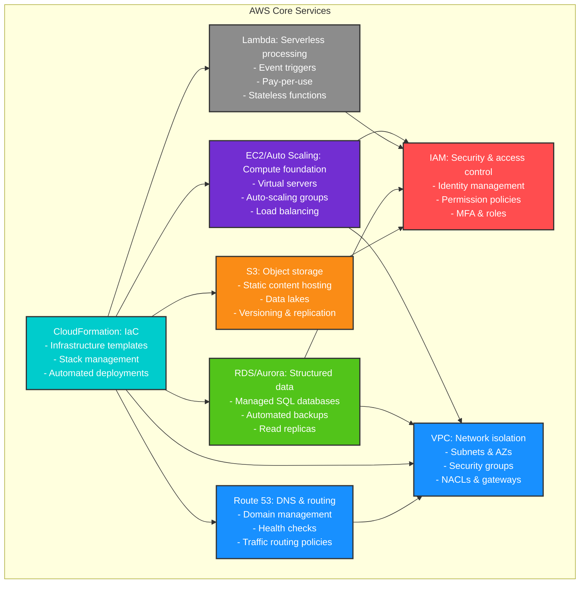
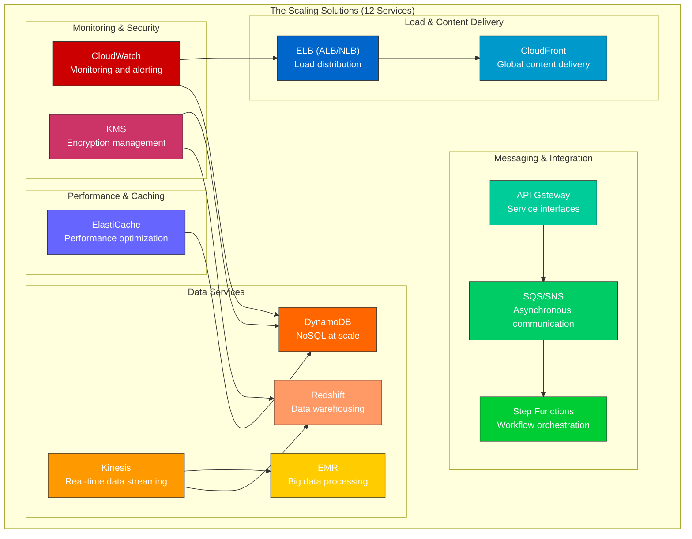

# [AWS] Mastering AWS Solution Architect Professional: A Strategic Guide to 150+ Services

I've been staring at the AWS Solutions Architect Professional certification for the past six months, and honestly? I think most people are approaching it completely wrong.

Last week, I was chatting with a senior architect at a Fortune 500 company who'd just failed his third attempt. "There are just too many services," he said. "How am I supposed to memorize 150+ different tools?" And that's when it hit me—he was asking the wrong question entirely.

## The Problem Everyone Gets Wrong
Most certification guides treat AWS like a vocabulary test. They'll tell you to memorize that RDS is for databases, EC2 is for compute, and S3 is for storage. But here's what I've learned after helping dozens of engineers pass this exam: **the AWS Solutions Architect Professional isn't testing your ability to memorize services—it's testing your ability to think like an architect.**

I spent my first two study attempts drowning in service documentation. I could tell you the difference between EBS gp2 and gp3 volumes, but I couldn't design a disaster recovery strategy to save my life. Sound familiar?

## My Framework: The 80/20 Architecture Principle
After analyzing every practice question I could get my hands on (and I mean _every_ question—I'm talking about 2,000+ practice scenarios), I noticed something interesting. The exam consistently focuses on about 30 core services, but it's how these services interact that matters.

Think about it this way: you don't need to know every single Lambda runtime, but you absolutely need to understand when serverless makes sense versus containers, and when containers make sense versus traditional compute.

Here's the framework that finally made everything click for me:

### Tier 1: The Architecture Backbone (8 Services)

These are the services that appear in almost every solution:

+ **EC2/Auto Scaling**: Your compute foundation
+ **VPC**: Network isolation and security
+ **S3**: Storage and static content
+ **RDS/Aurora**: Structured data persistence
+ **Lambda**: Event-driven processing
+ **CloudFormation**: Infrastructure as code
+ **IAM**: Security and access control
+ **Route 53**: DNS and traffic routing

I call these the "backbone" because you literally cannot design enterprise solutions without them. If you don't deeply understand these eight, you're going to struggle regardless of how much you know about the other 140+ services.

### Tier 2: The Scaling Solutions (12 Services)

These kick in when you're designing for real-world enterprise scale:

+ **ELB (ALB/NLB)**: Load distribution
+ **CloudFront**: Global content delivery
+ **ElastiCache**: Performance optimization
+ **SQS/SNS**: Asynchronous communication
+ **API Gateway**: Service interfaces
+ **Step Functions**: Workflow orchestration
+ **DynamoDB**: NoSQL at scale
+ **Kinesis**: Real-time data streaming
+ **EMR**: Big data processing
+ **Redshift**: Data warehousing
+ **CloudWatch**: Monitoring and alerting
+ **KMS**: Encryption management

### Tier 3: The Specialized Tools (Everything Else)
Here's where most people get lost. Services like AWS Batch, AWS Glue, Amazon Macie—they're important, but they're specialized. You need to understand _when_ to use them, not necessarily _how_ to configure them in detail.

## What Really Trips People Up (And How I Fixed It)
After going through this process myself and coaching others, I've identified the three biggest mental blocks:

### 1. The "Service Catalog" Trap
**The Problem**: Treating AWS like a shopping catalog instead of a toolkit.

I used to approach problems by thinking, "What AWS service solves this?" Wrong approach. Now I think, "What's the business requirement, and what combination of services delivers the best solution?"

For example, when you see a question about "real-time analytics," don't immediately jump to Kinesis Analytics. Ask yourself: What's the data volume? What's the latency requirement? Who's consuming the results? Sometimes the answer is Lambda + DynamoDB. Sometimes it's EMR + S3. Sometimes it really is Kinesis.

### 2. The "Perfect Solution" Myth
**The Problem**: Looking for the one "correct" answer when AWS is all about trade-offs.

Here's something that took me way too long to understand: the exam isn't looking for perfect solutions—it's looking for _optimal_ solutions given specific constraints.

I remember one practice question about data migration that had me stumped for weeks. The scenario involved moving 100TB of data with a 1-week deadline and limited bandwidth. I kept gravitating toward AWS DataSync because it seemed "cleaner." But the optimal answer? AWS Snowball. Not because it's the best technology, but because it's the best solution for those specific constraints.

### 3. The "Latest and Greatest" Bias
**The Problem**: Assuming newer services are always better.

This one's particularly tricky because AWS releases new services constantly. I got burned on several practice questions because I kept suggesting AWS App Runner when a simple ALB + EC2 Auto Scaling was the better choice.

The exam tends to favor proven, well-understood solutions unless there's a compelling reason to use something newer. Lambda is great, but not everything needs to be serverless. Containers are powerful, but not every workload needs Kubernetes.

## My Study Strategy That Actually Worked

I'm going to be brutally honest here: I wasted months following traditional study guides. What finally worked was what I call "scenario-driven learning."

| Timeline       | Study Phase          | Key Activities                                                                 | Primary Objective                          |
|----------------|----------------------|--------------------------------------------------------------------------------|--------------------------------------------|
| Weeks 1–3   | Master the Backbone | Design solutions for real-world companies (e.g., Netflix) using core AWS services; map service interactions. | Understand how foundational services work together. |
| Weeks 4–6   | Add Complexity      | Integrate advanced services; solve constrained scenarios (e.g., *“Build DR without RDS”* or *“Optimize for $10k/month”*). | Develop enterprise-grade problem-solving skills. |
| Weeks 7–8   | Exam Simulation     | 3-hour timed practice with 75 questions; replicate exam conditions (no notes, strict focus). | Build mental stamina and exam readiness.   |

### Phase 1: Master the Backbone (Weeks 1-3)
Instead of reading AWS documentation, I designed solutions. I'd pick a real company—say, Netflix—and architect their core services using only Tier 1 services. How would you handle user authentication? Video storage? Content delivery? Database scaling?

This forced me to understand how services interact, not just what they do individually.

### Phase 2: Add Complexity (Weeks 4-6)
Same approach, but now I'd add Tier 2 services. How do you handle traffic spikes? What about disaster recovery? How do you monitor performance across regions?

I'd deliberately introduce constraints: "Design this, but you can't use RDS" or "Solve this with a $10,000 monthly budget." Constraints force creative thinking, which is exactly what the exam tests.

### Phase 3: Practice Like It's Game Day (Weeks 7-8)
Here's what most people skip: timed practice under exam conditions. I'd set a timer for 3 hours and work through 75 questions without breaks. No phone, no notes, no Googling.

The mental fatigue is real. Question 60 hits different than question 10, and you need to experience that before exam day.

## The Insights That Changed Everything
Three realizations fundamentally shifted how I approached this certification:

### 1. AWS Isn't Just About Technology—It's About Business
The exam consistently includes business context for a reason. "Cost-effective," "minimal operational overhead," "fastest time to market"—these aren't throwaway phrases. They're architectural constraints that should drive your decision-making.

I started approaching every scenario like a consulting engagement: What's the business trying to achieve? What are their constraints? What does success look like in six months?

### 2. Security Isn't a Service—It's a Design Philosophy
Early on, I thought security meant "use KMS for encryption and IAM for access control." But the exam tests whether you understand security as a fundamental design principle.

Every architectural decision has security implications. Public subnets versus private subnets. VPC endpoints versus internet gateways. Instance roles versus access keys. The exam wants to see that you think about security at every layer, not just as an afterthought.

### 3. There's Always a Simpler Solution
This might be the most important insight: when you're torn between two approaches, the simpler one is usually correct.

I spent 20 minutes on a practice question trying to architect a complex microservices solution with Step Functions, Lambda, and API Gateway. The correct answer? A single EC2 instance with a cron job. Sometimes the boring solution is the right solution.

## What This Means for Your Career
Here's something most certification guides won't tell you: passing this exam changes how you think about technology problems, period.

I find myself applying these architectural thinking patterns to everything now. Not just AWS, but system design in general. How do you balance consistency versus availability? When do you optimize for read performance versus write performance? How do you design for failure?

These are the questions that separate senior engineers from junior engineers, regardless of which cloud platform you're using.

## My Advice If You're Starting This Journey
Don't start with the practice tests. Start with real problems.

Pick a system you use every day—maybe your company's application, maybe a popular service like Spotify or Uber—and architect it on AWS. Start simple, then add complexity. What happens when you have millions of users? How do you handle a region outage? How do you migrate from your current architecture to this new one?

Most importantly, don't memorize services. Understand problems. The services will follow naturally.

I suspect we're going to see more certifications move in this direction—away from rote memorization and toward practical problem-solving. Which makes sense, because that's what architects actually do.

The key takeaway? Stop studying AWS services and start thinking like an AWS architect. The difference will surprise you.

---

_What's your biggest challenge with the AWS Solutions Architect Professional exam? I'd love to hear about your experience in the comments below._

