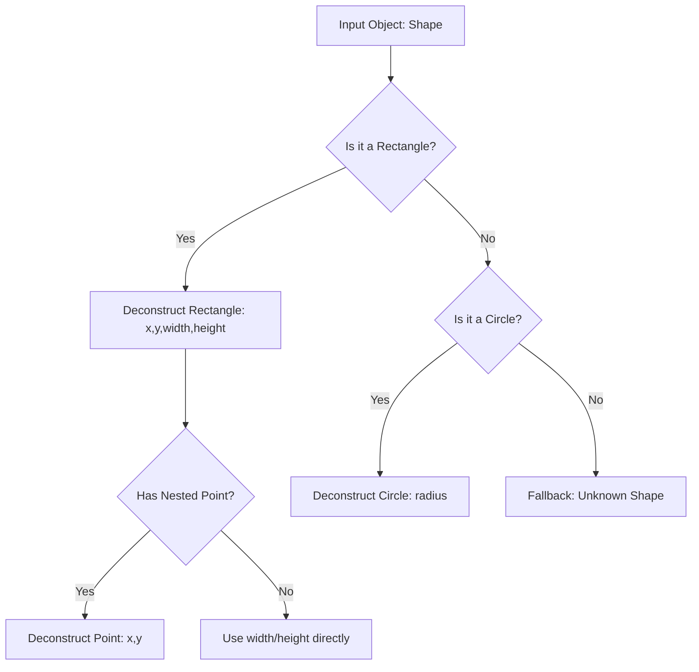
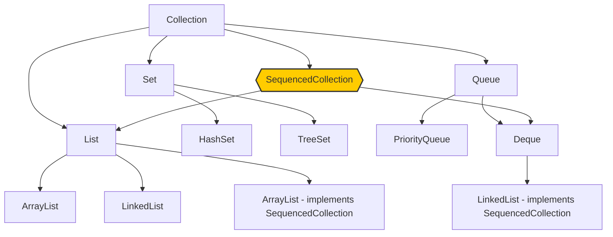

<!--
Title: 5 New Java 21 Features Every Developer Should Know

Jeff Taakey:
- AI Rate: 12.12% - Your Text is Most Likely Human written
- Words: 1549
- Time: xx minutes
- Tags: Java, Programming, Technology
- Summary: In this article, we'll explore five new Java 21 features that every developer should know.

-->

# 5 New Java 21 Features Every Developer Should Know

When **Java 21** was announced as the latest **Long Term Support(LTS)** release by Oracle official, I found myself genuinely excited about the language's direction for the first time in years. After spending considerable time with these new features in production environments, I want to share the **FIVE** key features that I believe will have the most significant impact on how we write Java code.

Let me be upfront about something: not every new feature is a game-changer, and some come with trade-offs you'll want to understand before diving in. These **FIVE** features represent a meaningful step forward in Java's evolution.

<!-- **[AdSense广告位置1]** -->

## Virtual Threads: Finally, Concurrency That Makes Sense

The most talked-about feature in Java 21 is virtual threads, and for good reason. If you've ever written server applications that handle thousands of concurrent connections, you know the pain of traditional thread management.

Here's what changed my perspective: I recently refactored a REST API that was struggling with thread pool exhaustion under load. The old approach looked like this:

```java
// Traditional approach - limited by platform threads
@RestController
public class OrderController {
    // annully setting for fix thread tool
    private final ExecutorService executor = Executors.newFixedThreadPool(200);
    
    @GetMapping("/orders/{id}")
    public CompletableFuture<Order> getOrder(@PathVariable String id) {
        return CompletableFuture.supplyAsync(() -> {
            // Expensive I/O operation
            return orderService.fetchOrder(id);
        }, executor);
    }
}
```

With virtual threads, the same functionality becomes remarkably simpler:

```java
// Virtual threads approach
@RestController
public class OrderController {
    
    @GetMapping("/orders/{id}")
    public Order getOrder(@PathVariable String id) {
        // This now runs on a virtual thread automatically
        return orderService.fetchOrder(id);
    }
}
```

<!-- **[配图：虚拟线程性能对比图表，显示内存使用和吞吐量差异]** -->

The key insight is that virtual threads aren't faster, but they're more efficient with resources. You can create millions of them without the memory overhead of platform threads. However, there's a catch: if your code spends significant time doing CPU-intensive work rather than waiting for I/O, virtual threads won't help much :(.

<!-- **[AdSense广告位置2]** -->

## Pattern Matching for Switch: Beyond Simple Enums

Switch expressions have come quite a distance, and pattern matching turns them into something actually useful. The old approach to handling different types usually led to verbose, error-prone code:

```java
// Old way - verbose and fragile
public String processShape(Object shape) {
    if (shape instanceof Circle) {
        Circle c = (Circle) shape;
        return "Circle with radius " + c.radius();
    } else if (shape instanceof Rectangle) {
        Rectangle r = (Rectangle) shape;
        return "Rectangle " + r.width() + "x" + r.height();
    } else if (shape instanceof Triangle) {
        Triangle t = (Triangle) shape;
        return "Triangle with base " + t.base();
    }
    return "Unknown shape";
}
```

Pattern matching transforms this into something much cleaner:

```java
// New way - concise and type-safe
public String processShape(Object shape) {
    return switch (shape) {
        case Circle(var radius) -> "Circle with radius " + radius;
        case Rectangle(var width, var height) -> "Rectangle " + width + "x" + height;
        case Triangle(var base, var height) -> "Triangle with base " + base;
        case null -> "No shape";
        default -> "Unknown shape";
    };
}
```

<!-- **[表格：传统 switch vs 模式匹配 switch 的代码行数和可读性对比]** -->

| Aspect                | Traditional `switch`                                                   | Pattern Matching `switch` (Java 21)                             |
| --------------------- | ---------------------------------------------------------------------- | --------------------------------------------------------------- |
| Typical Lines of Code | 12–20 lines (needs multiple `case` + explicit casting)                 | 6–10 lines (concise, direct matching with type patterns)        |
| Example Readability   | Verbose, repetitive type checks and casting                            | More compact, expresses intent clearly                          |
| Boilerplate           | High — must include multiple `break`, explicit `instanceof`, and casts | Low — pattern variables are introduced automatically            |
| Error-Proneness       | Higher — risk of missing `break` statements, redundant casting         | Lower — compiler enforces exhaustiveness and reduces redundancy |
| Maintainability       | Moderate — adding new cases requires more boilerplate                  | High — easier to extend with new patterns                       |
| Expressiveness        | Limited — cannot directly bind variables in `case`                     | Rich — allows binding and guarded patterns                      |

What I particularly appreciate is how this handles null values explicitly. No more hidden NullPointerExceptions lurking in your switch statements.

## Record Patterns: Destructuring Done Right

Record patterns build on the foundation of pattern matching, focusing specifically on extracting data from records. This is where things get interesting for data processing code.

Consider this scenario where you're processing nested data structures:

```java
public record Person(String name, Address address) {}
public record Address(String street, String city, String country) {}

// Extract city from nested records
public boolean isInUSA(Person person) {
    return switch (person) {
        case Person(var name, Address(var street, var city, "USA")) -> true;
        case Person(var name, Address(var street, var city, var country)) -> false;
    };
}
```

<!-- **[流程图：记录模式解构过程，展示如何从嵌套结构中提取数据]** -->



The pattern `Address(var street, var city, "USA")` destructures the Address record and matches against the specific country value. This eliminates a lot of boilerplate code for accessing nested fields.

<!-- **[AdSense广告位置3]** -->

## String Templates: Security by Design

String templates are still in preview, but they address a real problem with string interpolation. Traditional string formatting is either verbose or potentially unsafe:

```java
// Verbose but safe
String query = String.format(
    "SELECT * FROM users WHERE name = '%s' AND age > %d", 
    sanitize(userName), age);

// Concise but dangerous
String query = "SELECT * FROM users WHERE name = '" + userName + "' AND age > " + age;
```

String templates provide a middle ground:

```java
// Clean and safe (when using proper processors)
String query = SQL."SELECT * FROM users WHERE name = \{userName} AND age > \{age}";
```

The key is that different template processors can handle escaping and validation automatically. The `SQL` processor in the above example would handle SQL injection prevention.

Note: However, I should mention that this feature is still in development! The syntax and available processors will likely change before final release, so use it carefully in production code.

## Sequenced Collections: Order Matters

The new SequencedCollection interface fills a gap in Java's collections hierarchy that has bothered me for years. Previously, there was no common way to access the first and last elements of ordered collections.

<!-- **[配图：集合接口层次结构图，突出显示SequencedCollection的位置]** -->



Blow is the Java Code.

```java
// Before: different methods for different collection types
List<String> list = Arrays.asList("first", "middle", "last");
String firstFromList = list.get(0);
String lastFromList = list.get(list.size() - 1);

LinkedHashSet<String> set = new LinkedHashSet<>(list);
String firstFromSet = set.iterator().next(); // Awkward
// No direct way to get last element from set
```

Right now, we can get First and/or Last directly:

```java
// Now: consistent interface
SequencedCollection<String> collection = list; // or set
String first = collection.getFirst();
String last = collection.getLast();
```

This might seem like a small change, but it gets rid of a lot of collection-specific code when you work with ordered data.

<!-- **[AdSense广告位置4]** -->

## Should You Upgrade to Java 21?

The honest answer depends on your situation. If you're running microservices with heavy I/O, virtual threads alone might justify the upgrade. For applications doing complex data processing, pattern matching could significantly improve code clarity.

There are a couple of things to keep in mind:

How much work migration needs depends a lot on your current Java version. Upgrading from Java 17 to 21 is usually pretty simple, but one thing to note—older versions usually call for more patience and advance planning.

Some features are still in preview, so they might change in future updates. Virtual threads and pattern matching are stable, but you’ll want to use string templates carefully in production.

Your team’s readiness counts too. These features alter how you approach certain problems, and your team will need time to adjust their coding habits.

Here’s my suggestion: if you have I/O-heavy apps, start with virtual threads first, then slowly roll out pattern matching for new code. You can hold off on the other features until your team feels comfortable with the core shifts.

While Java 21 is a big step forward, it’s like any other tool—its value hinges on how much care and work you put into your specific issues.

---

<!-- **[AdSense广告位置5]** -->

*How have you found Java 21’s features? If you came across any unexpected upsides or challenges in your projects, don’t hesitate to share them in the comments below.*
